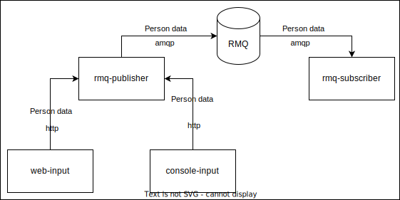
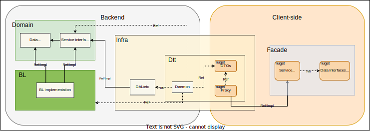

# P.R.S.S - Publication.Rabbit.Subscription.Storage
  The purpose of the project is to demonstrate the knowledge and skills of developing cross-platform applications on a micro-service architecture on .net, c#.

## Architecture overview
  This reference application is cross-platform at the server and client-side, thanks to .NET 6 services capable of running on Linux or Windows containers depending on your Docker host. The architecture proposes a microservice oriented architecture implementation with multiple autonomous microservices (each one owning its own data/db) using HTTP as the communication protocol between the client apps and the microservices and using AMQP as the communication protocol between microservices.

## Diagram of modules and interactions in the application
  

#### The solution consists of 4 modules: web-input, rmq-publisher, rmq-subscriber, console-input.
#### Each module is deployed in a separate container. The message broker RabbitMQ is also deployed in a separate container.

## Web-input-module: 
  Blazor app on .NET6, single web page for input data.
  
## Console-input-module:
  Console app on .NET6, can be used for fast data input, used during testing of other services.

## Rmq-publisher-module:
  The module consist of several projects on .NET 6: it accepts and validates data by http and sends it to RabbitMq.

## Rmq-subscriber-module:
The module accepts data from RabbitMq and it could do something else.

### Rmq-subscriber and rmq-publisher modules have a similar architecture for ease of understanding, it can be represented in several parts: FACADE, INFRA, DOMAIN, BL.

## FACADE:
  It contains service interfaces for interacting with the module, argument interfaces and their default implementations.

## INFRA (infrastructure):
  #### Proxy contains implementations of facade interfaces.
  #### Dto contains dto models.
  #### Daemon - program entry point, http api controllers, validations, app settings.

## DOMAIN: 
  It contains core interfaces of logic of the module

## BL:
  It contains implementations of domain interfaces.

## Diagram of the structure and connections in the module
  